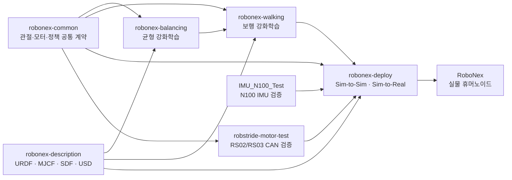

# RoboNex Walking

<div align="center">

**폐루프 링크 구조를 가진 12자유도 하체 휴머노이드 RoboNex의 보행 강화학습 프로젝트**

RoboNex의 로봇 모델, 공통 제어 계약, 균형·보행 학습, 모터·IMU 검증, 시뮬레이션 및 실기 배포 과정을 하나의 흐름으로 연결합니다.

[](https://youtu.be/tN_TbdNKPEo?si=ME0WL47wWYq7zZJ1)


</div>

## 프로젝트 개요

RoboNex는 무릎의 4절 링크와 두 모터가 결합된 차동 발목을 포함하는 하체 휴머노이드입니다. 단순한 직렬 관절 모델이 아니라 실제 기구의 폐루프 구조와 모터 공간을 반영한 모델을 사용하고, Isaac Lab에서 학습한 정책을 MuJoCo와 실제 CAN 모터 환경까지 연결하는 것을 목표로 합니다.

이 저장소는 전체 RoboNex 프로젝트 가운데 **평지 전진 보행 정책**을 담당합니다. 관련 기능은 여러 저장소로 분리되어 있지만, 대회 제출본인 이 README만으로도 전체 구성과 각 저장소의 역할을 파악할 수 있도록 정리했습니다.

| 구분 | 현재 설계 |
| --- | --- |
| 로봇 | 12개 구동 관절을 가진 RoboNex 하체 휴머노이드 |
| 핵심 기구 | 폐루프 무릎 4절 링크, 2모터 차동 발목 |
| 학습 환경 | NVIDIA Isaac Sim / Isaac Lab |
| 강화학습 | RSL-RL PPO |
| Gym Task | `RoboNex-Walking-v0` |
| 목표 동작 | 평지에서 `0.3 m/s` 고정 전진 속도 추종 |
| 물리·정책 주기 | 물리 `250 Hz`, 정책 `50 Hz` |
| 정책 입출력 | 관측 `42-D`, 행동 `12-D` |
| 병렬 환경 | `512` environments |
| 에피소드 | 최대 `20 s` |

## 전체 개발 구조



`robonex-common`이 관절 순서, 모터 파라미터, 관절 제한 및 정책 인터페이스를 고정하고, `robonex-description`이 동일한 로봇을 여러 시뮬레이터 형식으로 제공합니다. 본 저장소에서 학습한 정책은 `robonex-deploy`를 통해 MuJoCo 검증과 실제 하드웨어 적용 단계로 이어집니다.

## 연계 저장소

<div align="center">

[](https://github.com/Humanoid-Project/robonex-common)
[](https://github.com/Humanoid-Project/robonex-description)
[](https://github.com/Humanoid-Project/robonex-balancing)
[](https://github.com/Humanoid-Project/robonex-walking)
[](https://github.com/Humanoid-Project/robonex-deploy)
[](https://github.com/Humanoid-Project/robstride-motor-test)
[](https://github.com/Humanoid-Project/IMU_N100_Test)

</div>

| 저장소 | 역할 | 본 프로젝트와의 연결 |
| --- | --- | --- |
| `robonex-common` | 관절 ID·순서·제한, RS02/RS03 사양, CAN 및 정책 계약 | 보행 정책의 12개 관절 순서와 행동 정규화 공유 |
| `robonex-description` | URDF, MJCF, SDF, USD 로봇 모델 | Isaac Lab의 폐루프 mesh USD 제공 |
| `robonex-balancing` | 정적 균형 PPO 학습 | 관측·행동 계약과 안정화 설계를 보행 과제로 확장 |
| `robonex-walking` | 평지 전진 보행 PPO 학습 | 대회 제출 및 현재 저장소 |
| `robonex-deploy` | Isaac–MuJoCo–실물 로봇 연결 | 정책 manifest 검증과 Sim-to-Sim/Sim-to-Real 담당 |
| `robstride-motor-test` | RobStride RS02/RS03 CAN 측정·제어 | 모터 ID, 물리 특성 및 실제 관절 동작 검증 |
| `IMU_N100_Test` | WHEELTEC N100 C++/ROS 2 SDK | 실제 정책 관측에 필요한 각속도·자세 정보 제공 |

## 보행 강화학습 설계

### 정책 인터페이스

관측에는 속도 명령을 별도로 넣지 않고 `0.3 m/s`의 단일 전진 속도를 추종하도록 설계했습니다. 현재 42차원 계약을 유지한 채 임의의 목표 속도를 학습시키면 정책이 현재 명령을 구분할 수 없기 때문입니다. 가변 속도나 회전 명령을 추가하려면 관측 차원과 배포 정책 계약을 함께 확장해야 합니다.

| 관측 항목 | 차원 | 내용 |
| --- | ---: | --- |
| 관절 상대 위치 | 12 | 12개 구동 관절의 기준 자세 대비 위치 |
| 관절 상대 속도 | 12 | 12개 구동 관절의 속도 |
| IMU 각속도 | 3 | 몸체 좌표계의 각속도 |
| 투영 중력 벡터 | 3 | 몸체 기울기를 나타내는 중력 방향 |
| 이전 행동 | 12 | 직전 정책 출력 |
| **합계** | **42** | 정책 입력 벡터 |

정책은 12개 모터 공간 관절의 위치 목표를 출력합니다. 원시 행동은 제한된 뒤 관절별 offset과 scale을 거쳐 물리 목표로 변환되며, 최종 목표는 각 관절의 안전 범위 안에서 다시 제한됩니다.

### 보상함수 구조

전체 보상은 설정된 항목의 가중합으로 구성됩니다.

`R = Σᵢ wᵢ rᵢ`

아래 표의 수식은 각 항목이 반환하는 값을 요약한 것입니다. `B(x, L) = clamp(nan_to_num(x), -L, L)²`, `I(·)`는 조건이 참일 때 1인 지시함수, `cᵢ`는 발 `i`의 접촉 상태를 뜻합니다.

| 항목 · 가중치 | 수식 | 설명 |
| --- | --- | --- |
| 생존 `alive` · `+1.0` | `I(에피소드 생존)` | 넘어지지 않고 동작을 지속하도록 보상 |
| 종료 `terminating` · `-5.0` | `I(종료 발생)` | 낙상 또는 불안정 상태로 종료되는 행동 억제 |
| 전진 속도 추종 `track_lin_vel_x` · `+3.0` | `exp(-B(vₓ - 0.3, 5) / 0.25²)` | yaw 정렬 좌표계에서 목표 전진 속도 `0.3 m/s` 추종 |
| 단일 지지 시간 `feet_air_time` · `+2.0` | `clip(I(single) × min(t_mode,L, t_mode,R), 0, 0.35)` | 한 발 지지·한 발 스윙 상태를 유지해 실제 보행 주기 유도 |
| 몸체 수평 유지 `flat_orientation` · `-5.0` | `B(gₓ, 1) + B(gᵧ, 1)` | 투영 중력의 수평 성분을 줄여 roll·pitch 기울기 억제 |
| 기준 높이 유지 `base_height` · `-10.0` | `B(z_base - 1.0789, 2)` | 몸체 높이를 기준값 `1.0789 m` 부근에 유지 |
| 횡방향 속도 `lin_vel_y` · `-2.0` | `B(vᵧ, 10)` | 좌우로 흐르는 움직임 억제 |
| 수직 속도 `lin_vel_z` · `-2.0` | `B(v_z, 10)` | 불필요한 상하 진동과 도약 억제 |
| yaw 각속도 `ang_vel_z` · `-0.5` | `B(ω_z, 10)` | 직진 중 몸체가 회전하는 현상 억제 |
| roll·pitch 각속도 `ang_vel_xy` · `-0.05` | `B(ωₓ, 10) + B(ωᵧ, 10)` | 몸체의 좌우·앞뒤 흔들림 완화 |
| 양발 간격 `feet_width` · `-10.0` | `B(abs(y_L - y_R) - 0.321, 2)` | 몸체 좌표계에서 양발 폭을 `0.321 m` 부근에 유지 |
| 스윙 발 높이 `feet_clearance` · `-20.0` | `Σᵢ (1-cᵢ) B(hᵢ - 0.06, 1)` | 지면에서 떨어진 발이 목표 높이 `0.06 m`를 따르도록 유도 |
| 발 미끄러짐 `foot_slip` · `-2.0` | `Σᵢ cᵢ[B(vₓ,ᵢ, 10) + B(vᵧ,ᵢ, 10)]` | 지면과 접촉한 발의 수평 미끄러짐 억제 |
| 비행 구간 `flight_phase` · `-1.0` | `I(c_L + c_R = 0)` | 두 발이 동시에 뜨는 달리기·점프 형태 억제 |
| 행동 변화율 `action_rate` · `-0.015` | `Σⱼ B((a_t,j - a_t-1,j)sⱼ, 6)` | 관절별 물리 scale을 반영해 급격한 목표 변화 억제 |
| 관절 기준 자세 `joint_deviation_yaw_roll` · `-0.5` | `Σⱼ clip(abs(qⱼ - q_default,j), 0, 2)` | 직진 보행에 필요한 hip yaw·roll 관절만 기준 자세에서의 이탈 억제 |
| 관절 토크 `joint_torques` · `-2×10⁻⁵` | `Σⱼ B(τⱼ, 100)` | 과도한 구동 토크를 줄여 효율적인 동작 유도 |
| 관절 가속도 `joint_acc` · `-2.5×10⁻⁷` | `Σⱼ B(q̈ⱼ, 2000)` | 고주파 진동과 급격한 관절 운동 억제 |

보상 계산의 제곱 오차에는 NaN/Inf 처리와 상한을 적용해 비정상 상태가 학습 전체의 수치 발산으로 이어지지 않도록 구성했습니다. 위 가중치는 현재 구현된 초기 설계값이며, 학습 결과에 따라 조정할 수 있습니다.

### 도메인 랜덤화

| 대상 | 범위 | 목적 |
| --- | --- | --- |
| actuator stiffness | 기준값의 `0.9–1.1`배 | 제어 강성 오차 대응 |
| actuator damping | 기준값의 `0.8–1.2`배 | 감쇠 특성 오차 대응 |
| 초기 yaw | `-π–π rad` | 월드 방향과 무관한 전진 정책 학습 |
| 초기 몸체 속도 | 평면·회전축별 `-0.2–0.2` | 초기 상태 변화 대응 |
| 외란 속도 | `5–8 s`마다 x/y `-0.3–0.3 m/s` | 보행 중 외란 회복 유도 |
| 접촉 마찰 | 정지·동마찰 `0.4–0.8` | 지면 조건 변화 대응 |
| 관절 마찰 | 기준값에 `0.0–0.02` 추가 | 실제 구동부 편차 반영 |
| base mass | 기준값에 `-0.3–0.3 kg` 추가 | 질량 오차 대응 |
| 센서 관측 | 관절·IMU·중력 항목별 노이즈 | Sim-to-Real 관측 편차 완화 |

### 종료 조건

| 조건 | 기준 | 목적 |
| --- | --- | --- |
| 시간 제한 | `20 s` | 고정 길이 에피소드 구성 |
| 낙상 | base 높이 `< 0.6 m` | 회복 불가능한 자세 조기 종료 |
| 관절 불안정 | 관절 속도 절댓값 `> 100 rad/s` 또는 비유한 값 | 폐루프 기구의 비정상 상태 차단 |

## 학습 구성

| 항목 | 설정 |
| --- | --- |
| 알고리즘 | PPO |
| Actor/Critic | `[256, 128, 128]`, ELU |
| 초기 action noise | `0.5` |
| Rollout | 환경당 `24` steps |
| 최대 반복 | `6000` iterations |
| Discount / GAE | `γ = 0.99`, `λ = 0.95` |
| Learning rate | `1.0×10⁻³`, adaptive schedule |
| PPO clip | `0.2` |
| Entropy coefficient | `0.005` |
| Raw action clip | `±3.0` |

## 현재 구현 상태

| 구분 | 상태 |
| --- | --- |
| `RoboNex-Walking-v0` task 등록 | 구현 완료 |
| 폐루프 RoboNex USD 및 공통 관절 계약 연결 | 구현 완료 |
| 42차원 관측·12차원 행동 구성 | 구현 완료 |
| 보행 보상함수 및 도메인 랜덤화 | 구현 완료 |
| 낙상·관절 속도 종료 조건 | 구현 완료 |
| Isaac Lab 학습 및 정책 성능 평가 | 검증 진행 예정 |
| MuJoCo Sim-to-Sim 검증 | 정책 학습 후 진행 예정 |
| 실제 RoboNex Sim-to-Real 적용 | 시뮬레이션 검증 후 진행 예정 |

상단 영상은 RoboNex의 개발 및 하드웨어 시연 자료입니다. 보행 정책의 정량 성능과 실기 적용 결과는 학습·검증이 완료된 뒤 별도로 갱신합니다.

## 저장소 구성

```text
robonex-walking/
├── README.md
├── scripts/
│   ├── list_envs.py
│   ├── zero_agent.py
│   ├── random_agent.py
│   ├── export_policy_manifest.py
│   └── rsl_rl/
│       ├── train.py
│       └── play.py
└── source/robonex_walking/
    └── robonex_walking/tasks/manager_based/robonex_walking/
        ├── agents/
        ├── mdp/
        ├── robot_contract.py
        └── robonex_walking_env_cfg.py
```

---

Developed by [Humanoid-Project](https://github.com/Humanoid-Project).
